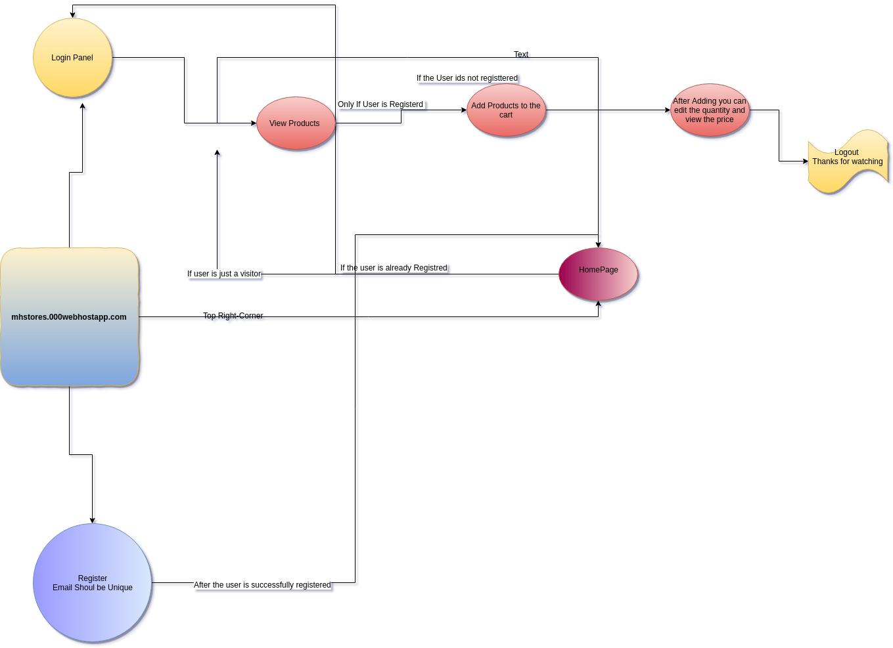

# ShoppingCart

# Intro

In online marketing, a shopping cart is a piece of e-commerce software on a web server that allows visitors to an Internet site to select items for eventual purchase.

The software allows online shopping customers to accumulate a list of items for purchase, described metaphorically as “placing items in the shopping cart” or “add to cart.” Upon checkout, the software typically calculates a total for the order, including shipping and handling (i.e., postage and packing) charges and the associated taxes, as applicable. Shopping cart also bridge the gap between shopping and buying.
